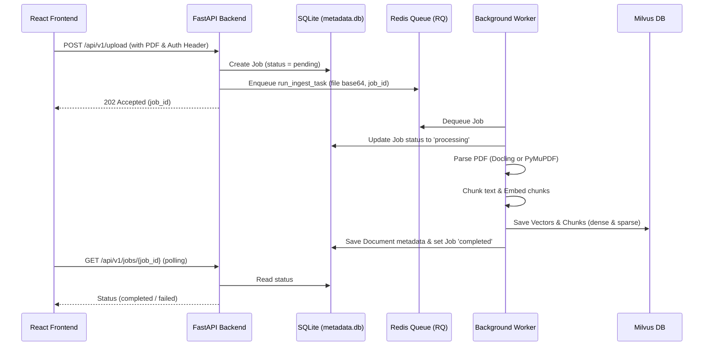
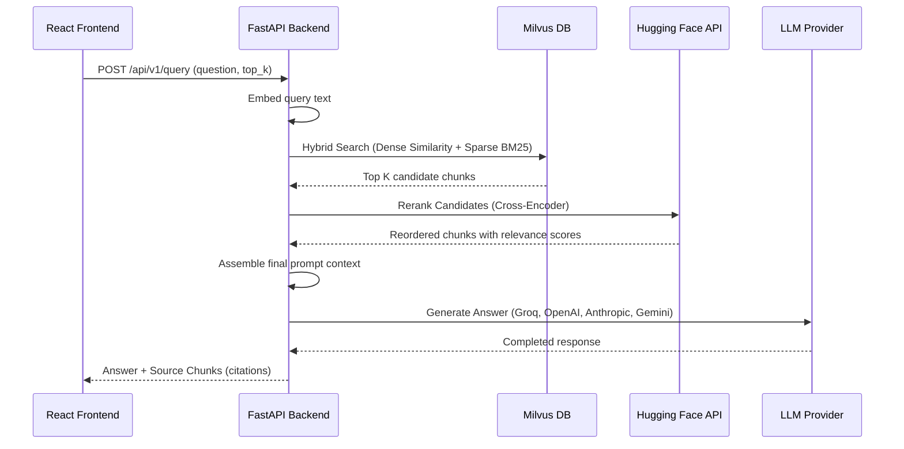

# RAG Milvus Assistant (Production Grade)

A modular, production-ready Retrieval-Augmented Generation (RAG) system built with Python, FastAPI, React 19 (Vite), Milvus (Lite/Standalone), Redis, and SQLite.

The architecture supports structure-aware document parsing, hybrid search (dense + sparse), serverless cross-encoder reranking, asynchronous ingestion pipelines, and Firebase authentication.

---

## Key Features

- **Frontend**: React 19 application powered by Vite, incorporating Firebase Client SDK for user authentication.
- **Background Ingestion**: Asynchronous document processing using Redis & RQ (Redis Queue) to handle heavy parsing and embedding generation tasks safely.
- **Advanced Document Parsing**: Supports both standard text extraction (`pymupdf`) and structure-aware parsing (`docling`) which captures logical tables, headers, and metadata.
- **Flexible Chunking**: Standard recursive character chunking or Docling's hybrid chunking, which prepends section hierarchies (e.g. `[Heading 1 > Subheading]`) to text chunks to maintain context during search.
- **Pluggable Embeddings**: Standardized interfaces supporting Google Gemini (`gemini-embedding-2`), OpenAI, and Voyage AI.
- **Milvus Vector Database**:
  - **Dense Search**: Traditional vector similarity search.
  - **Sparse Search**: Native BM25-based keyword search using Milvus's sparse vector capabilities.
  - **Hybrid Search**: Fuses dense and sparse search results within Milvus using Reciprocal Rank Fusion (RRF).
- **Hugging Face Reranking**: Cross-encoder models (e.g., `BAAI/bge-reranker-v2-m3`) queried via Hugging Face Serverless Inference API.
- **Multi-LLM Support**: Wrappers for Groq, OpenAI, Anthropic, and Gemini.
- **Metadata Database**: SQLite database (`metadata.db`) managed via SQLAlchemy for storing document records and background job states.
- **Authentication**: Route-level Firebase authentication checks.

---

## Directory Architecture

```
Production_RAG/
├── backend/
│   ├── api/                  # FastAPI router & endpoint definitions
│   │   ├── auth.py           # Firebase ID token verification middleware
│   │   ├── dependencies.py   # DB sessions and service accessors
│   │   ├── documents.py      # Document CRUD and download endpoints
│   │   ├── health.py         # Readiness & Liveness checks
│   │   ├── jobs.py           # Upload triggers and background job status polling
│   │   ├── query.py          # RAG querying & citation responses
│   │   └── routes.py         # Global Router aggregator
│   ├── config/
│   │   └── settings.py       # Pydantic Settings management (loads from .env)
│   ├── database/
│   │   ├── models.py         # SQLAlchemy schemas for Document and JobStatus
│   │   └── session.py        # Database connection engine & session factories
│   ├── ingestion/            # Pipeline for handling uploads
│   │   ├── chunkers/         # Docling hybrid and recursive text chunkers
│   │   ├── parsers/          # PyMuPDF and Docling document converters
│   │   └── pipeline.py       # Document Parser factory
│   ├── rag/                  # Retrieval-Augmented Generation core
│   │   ├── embeddings/       # Embedding providers (Gemini, OpenAI, Voyage)
│   │   ├── llm/              # LLM service wrappers (Groq, OpenAI, Anthropic, Gemini)
│   │   ├── chunking.py       # ChunkRecord schema definitions
│   │   ├── pipeline.py       # Links retrieval, formatting, and generation
│   │   ├── prompts.py        # Prompts and system template configurations
│   │   └── retrieval.py      # Dense/Sparse/Hybrid vector search executor
│   ├── services/             # Core business logic orchestrators
│   │   ├── document_service.py  # Deleting and fetching metadata documents
│   │   ├── ingest_service.py    # Main ingestion worker (parse, embed, save to Milvus)
│   │   ├── job_status_service.py# Status updates for asynchronous task queues
│   │   └── reranker_service.py  # HF cross-encoder API client
│   ├── utils/
│   │   └── logging_context.py   # Unified logging format with Correlation IDs
│   ├── vectordb/             # Vector database adapters
│   │   ├── client.py         # Milvus connection pool loaders
│   │   ├── schema.py         # Automated Milvus collection provisioning
│   │   ├── reads.py          # Dense, sparse and hybrid search queries
│   │   └── writes.py         # Vector insertion and deletion queries
│   ├── main.py               # FastAPI server entry point, CORS, correlation logging middleware
│   ├── tasks.py              # RQ worker entrypoint executing background ingestion tasks
│   └── worker.py             # RQ Worker listener (supports Windows SimpleWorker)
├── frontend-react/           # Vite + React 19 Frontend App
└── requirements.txt          # Python dependencies
```

---

## Data Flows

### Ingestion Flow (Asynchronous)


### Retrieval & Generation Flow (Synchronous Query)


---

## Local Setup

### Prerequisites
- Python 3.10+
- Redis (running locally or remotely)
- Node.js (for React frontend)

### 1. Configuration (`.env`)
Create a `.env` file in the project root:

```env
APP_NAME="RAG Milvus App"
LOG_LEVEL="INFO"
DATABASE_URL="sqlite:///./metadata.db"
REDIS_URL="redis://localhost:6379/0"

# Milvus Configuration
# For Milvus Lite, use a local filepath ending in .db.
# For Standalone, use the HTTP endpoint (e.g. http://localhost:19530).
MILVUS_URI="./milvus_local.db"
MILVUS_COLLECTION_NAME="rag_documents"
MILVUS_DIMENSION=1536

# Ingestion Settings
DOCUMENT_PARSER="pymupdf"  # Options: "pymupdf", "docling"
CHUNK_SIZE=1000
CHUNK_OVERLAP=150

# Providers
EMBEDDING_PROVIDER="gemini" # Options: "gemini", "openai", "voyage"
EMBEDDING_MODEL_NAME="gemini-embedding-2"
GEMINI_API_KEY="your-gemini-api-key"
OPENAI_API_KEY="your-openai-api-key"
VOYAGE_API_KEY="your-voyage-api-key"

LLM_PROVIDER="groq"        # Options: "groq", "openai", "anthropic", "gemini"
LLM_MODEL="llama-3.1-8b-instant"
GROQ_API_KEY="your-groq-api-key"
ANTHROPIC_API_KEY="your-anthropic-api-key"

# Reranker Settings
RERANKER_ENABLED=true
RERANKER_MODEL_NAME="BAAI/bge-reranker-v2-m3"
HF_TOKEN="your-huggingface-token"
RERANKER_CANDIDATE_K=25

# Firebase Auth (Optional if running without client verification)
FIREBASE_CREDENTIALS_PATH="backend/firebase-key.json"
```

### 2. Backend & Worker Setup
Install dependencies in a virtual environment:
```bash
python -m venv venvrag
# Activate the venv (Windows: venvrag\Scripts\activate, Linux/macOS: source venvrag/bin/activate)
pip install -r requirements.txt
```

Start the FastAPI API Server:
```bash
uvicorn backend.main:app --host 0.0.0.0 --port 8000 --reload
```

Start the Background RQ Worker (in a separate terminal):
```bash
python -m backend.worker
```
*(On Windows, this automatically boots in `SimpleWorker` mode to avoid Python `fork` limitations).*

### 3. Frontend Setup
Navigate to the frontend directory, install packages, and start the development server:
```bash
cd frontend-react
npm install
npm run dev
```

---

## API Documentation

Interactive API documentation is generated automatically by FastAPI:
- **Swagger UI**: [http://localhost:8000/docs](http://localhost:8000/docs)
- **ReDoc**: [http://localhost:8000/redoc](http://localhost:8000/redoc)

### Primary Endpoints

| Method | Endpoint | Description |
|---|---|---|
| `GET` | `/api/v1/health` | Diagnostic liveness checks for Milvus, SQLite, and services. |
| `POST` | `/api/v1/upload` | Upload a PDF. Enqueues background ingestion and returns a `job_id`. |
| `GET` | `/api/v1/jobs/{job_id}` | Check the progress/status of an ingestion job. |
| `POST` | `/api/v1/query` | Submit a prompt to query documents. Returns synthesized answers and citations. |
| `GET` | `/api/v1/documents` | Retrieve a list of all indexed documents for the user. |
| `DELETE` | `/api/v1/documents/{document_id}` | Purge document files from disk and remove vectors from Milvus. |
| `GET` | `/api/v1/documents/{document_id}/download` | Download the original PDF document file. |

