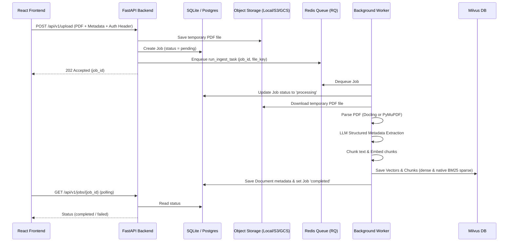
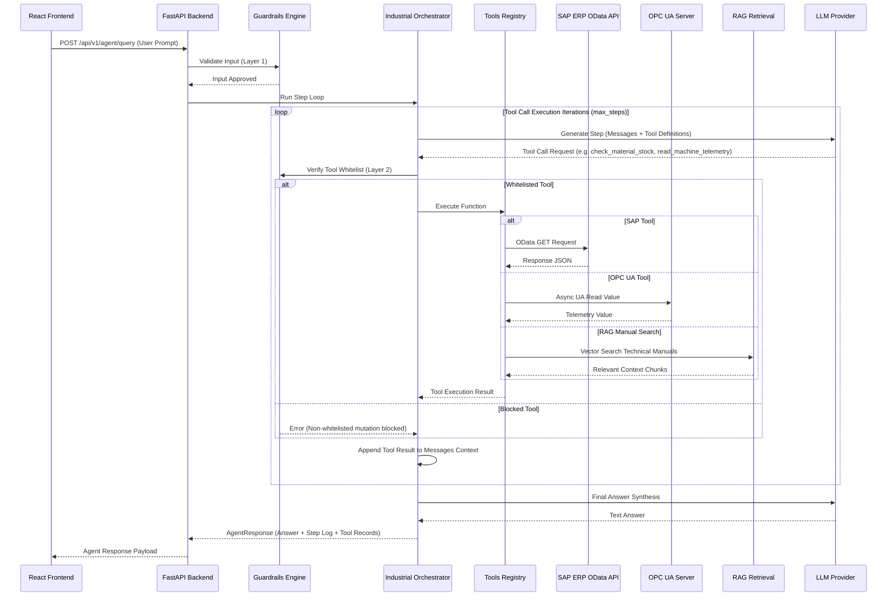

# Industrial AI Platform & Production RAG Assistant

A modular, production-ready **Retrieval-Augmented Generation (RAG)** and **Industrial AI Multi-Agent System** built with Python, FastAPI, React 19 (Vite), Milvus (Lite/Standalone), Redis, SQLite/PostgreSQL, SAP ERP, and OPC UA.

The architecture supports structure-aware document parsing, hybrid search (dense + sparse BM25), serverless cross-encoder reranking, asynchronous ingestion pipelines, 3-layer safety guardrails, Permit-to-Work (PTW) safety audits, and real-time industrial telemetry/ERP tool orchestration.

---

## Key Features

- **Frontend**: React 19 application powered by Vite, incorporating dark/light themes, real-time agent/RAG chats, safety review dashboards, document manager, and Firebase Client SDK authentication.
- **Background Ingestion Pipeline**: Asynchronous document processing using Redis & RQ (Redis Queue) with OS-aware workers (`SimpleWorker` for Windows, `Worker` for Linux/Unix) to prevent HTTP timeouts during parsing and embedding.
- **Advanced Document Parsing**: Supports high-speed text extraction (`pymupdf`) and structure-aware parsing (`docling`) capturing logical tables, headers, and metadata.
- **Flexible Chunking**: Standard recursive character chunking or Docling's hybrid chunking, prepending section hierarchies (e.g. `[Heading 1 > Subheading]`) to text chunks.
- **Pluggable Embeddings**: Standardized interfaces supporting Google Gemini (`gemini-embedding-2`), OpenAI, and Voyage AI.
- **Milvus Vector Database**:
  - **Dense Search**: Vector similarity search (HNSW / FLAT).
  - **Sparse Search**: Native BM25-based keyword search using Milvus's sparse vector capabilities.
  - **Hybrid Search**: Fuses dense and sparse search results within Milvus using Reciprocal Rank Fusion (RRF).
- **Cross-Encoder Reranking**: Re-orders candidate search hits via Hugging Face Serverless Inference API (`BAAI/bge-reranker-v2-m3`) or Voyage AI.
- **Industrial Multi-Agent Orchestrator**: Async tool execution loop connecting LLMs with live industrial diagnostics:
  - **OPC UA Telemetry**: Real-time sensor reading, node browsing, alarm monitoring, tag catalog indexing, and historical data retrieval.
  - **SAP ERP Connectors**: OData REST queries for Plant Maintenance (PM), Materials Management (MM), Production Planning (PP), and Quality Management (QM).
- **3-Layer Production Guardrails**:
  - **Layer 1 (Input Validation)**: Regex-based prompt injection detection and query size limiting.
  - **Layer 2 (Tool Execution Whitelist)**: Enforces a strict read-only tool whitelist (`check_tool_allowed`) to prevent unauthorized SAP or OPC UA state mutations.
  - **Layer 3 (Output Grounding)**: Verifies that numerical claims in LLM answers are present in the retrieved source context chunks.
- **Permit-to-Work (PTW) Safety Auditing**: Automated safety review endpoint (`/api/v1/review`) evaluating work permits against retrieved OEM manuals and SOPs, outputting structured JSON severity reports (`SafetyReviewReport`).
- **Pluggable Object Storage**: Supports Local disk, AWS S3, and Google Cloud Storage (GCS) for raw PDF storage.
- **Authentication**: Firebase ID token verification middleware with route-level user isolation.

---

## Directory Architecture

```
Production_RAG/
├── backend/
│   ├── agents/               # Industrial Multi-Agent Orchestration
│   │   ├── llm_provider.py   # Multi-provider LLM step generator (OpenAI & Gemini REST)
│   │   ├── orchestrator.py   # Async tool loop orchestrator
│   │   ├── prompts.py        # System prompt for industrial diagnostics & troubleshooting
│   │   ├── schemas.py        # Pydantic schemas for Agent queries, tool logs, and responses
│   │   └── tools_registry.py # Tool declarations and function execution mapping
│   ├── api/                  # FastAPI router & endpoint definitions
│   │   ├── agent.py          # Industrial Agent query endpoint (/api/v1/agent/query)
│   │   ├── auth.py           # Firebase ID token verification middleware
│   │   ├── dependencies.py   # DB sessions and service accessors
│   │   ├── documents.py      # Document CRUD and PDF file download endpoints
│   │   ├── health.py         # Diagnostic health & deep readiness checks
│   │   ├── jobs.py           # Upload triggers and background job status polling
│   │   ├── opcua.py          # OPC UA tag catalog sync endpoints
│   │   ├── query.py          # RAG querying & Permit-to-Work safety review endpoints
│   │   └── routes.py         # Global Router aggregator
│   ├── config/
│   │   └── settings.py       # Pydantic Settings management (loads from .env)
│   ├── connectors/           # Enterprise & Industrial Protocol Adapters
│   │   ├── opcua/            # OPC UA Protocol client & crawler
│   │   │   ├── browser.py    # Address space node navigation & catalog builder
│   │   │   ├── config.py     # OPC UA client settings (Pydantic)
│   │   │   ├── connection.py# Connection lifecycle manager (asyncua)
│   │   │   ├── crawler.py    # Address space Tag Catalog crawler
│   │   │   ├── exceptions.py # OPC UA exception definitions
│   │   │   ├── indexer.py    # Tag catalog database indexer
│   │   │   └── reader.py     # Real-time sensor, history, & telemetry reader
│   │   └── sap/              # SAP ERP OData REST Client
│   │       ├── client.py     # HTTP connection manager, OAuth2, CSRF token handling
│   │       ├── config.py     # SAP client configuration
│   │       ├── exceptions.py # SAP exception definitions
│   │       └── tools/        # Business domain query tools
│   │           ├── mm_tools.py# Materials Management (Stock, Master Data, BOM)
│   │           ├── pm_tools.py# Plant Maintenance (Equipment, Notifications, Work Orders)
│   │           ├── pp_tools.py# Production Planning (Production Orders, Operations)
│   │           └── qm_tools.py# Quality Management (Inspection Lots, Quality Notifications)
│   ├── database/
│   │   ├── models.py         # SQLAlchemy schemas (Document, IngestionJob, OPCUATagCatalog)
│   │   └── session.py        # Async database connection engine & session factory
│   ├── ingestion/            # Document parsing & chunking pipeline
│   │   ├── chunkers/         # Docling hybrid and recursive character text chunkers
│   │   ├── parsers/          # PyMuPDF and Docling document converters
│   │   └── pipeline.py       # Cached document parser factory
│   ├── rag/                  # Retrieval-Augmented Generation core
│   │   ├── embeddings/       # Embedding providers (Gemini, OpenAI, Voyage)
│   │   ├── llm/              # LLM service wrappers (Groq, OpenAI, Anthropic, Gemini)
│   │   ├── chunking.py       # ChunkRecord schema definitions
│   │   ├── pipeline.py       # RAG pipeline for QA generation & safety reviews
│   │   ├── prompts.py        # Prompts and system template configurations
│   │   └── retrieval.py      # Dense, Sparse BM25 & Hybrid search executor with dynamic filters
│   ├── schemas/              # Pydantic data schemas for API requests & responses
│   │   ├── documents.py      # Document metadata and upload response schemas
│   │   ├── health.py         # Health check response schemas
│   │   ├── jobs.py           # Job status response schemas
│   │   ├── query.py          # RAG query request and citation response schemas
│   │   └── safety.py         # Safety audit request and report schemas
│   ├── services/             # Core business logic orchestrators
│   │   ├── document_service.py # Document deletion and metadata retrieval
│   │   ├── hf_reranker.py     # Hugging Face Serverless Cross-Encoder client
│   │   ├── ingest_service.py   # Ingestion worker (parse, metadata extraction, embed, store)
│   │   ├── job_status_service.py # Ingestion job state manager
│   │   ├── reranker_service.py   # Reranker routing facade
│   │   ├── storage.py          # Storage abstraction (Local, S3, GCS)
│   │   └── voyage_reranker.py  # Voyage AI Reranker API client
│   ├── utils/
│   │   ├── guardrails.py       # 3-layer security guardrails & grounding verifier
│   │   └── logging_context.py  # Unified logging format with Correlation IDs
│   ├── vectordb/             # Vector database adapters (Milvus)
│   │   ├── client.py         # Milvus connection pool loaders (Lite & Standalone)
│   │   ├── filters.py        # Metadata filter expression builders
│   │   ├── milvus_db.py      # Main Milvus store facade
│   │   ├── reads.py          # Dense similarity, BM25 sparse, and RRF hybrid search
│   │   ├── schema.py         # Automated collection schema provisioning & BM25 indexing
│   │   └── writes.py         # Vector insertion and deletion logic
│   ├── main.py               # FastAPI server entry point, CORS, logging middleware
│   ├── tasks.py              # RQ worker entrypoint executing background ingestion tasks
│   └── worker.py             # RQ Worker listener (supports Windows SimpleWorker)
├── frontend-react/           # Vite + React 19 Frontend App
├── tests/                    # Pytest test suite, conftest, and mock providers
└── requirements.txt          # Python dependencies
```

---

## Data Flows

### 1. Ingestion Flow (Asynchronous)


### 2. Industrial Multi-Agent Orchestration Flow


---

## Local Setup

### Prerequisites
- Python 3.10+
- Redis (running locally or via Docker)
- Node.js 18+ (for React frontend)

### 1. Configuration (`.env`)
Create a `.env` file in the project root:

```env
APP_NAME="Industrial AI RAG Platform"
LOG_LEVEL="INFO"
DATABASE_URL="sqlite:///./metadata.db"
REDIS_URL="redis://localhost:6379/0"

# Milvus Configuration
# For Milvus Lite, use a local filepath ending in .db.
# For Standalone, use the HTTP endpoint (e.g. http://localhost:19530).
MILVUS_URI="./milvus_local.db"
MILVUS_COLLECTION_NAME="rag_documents"
MILVUS_DIMENSION=1536

# Storage Provider Settings ("local", "s3", "gcs")
STORAGE_PROVIDER="local"
AWS_ACCESS_KEY_ID=""
AWS_SECRET_ACCESS_KEY=""
AWS_REGION="us-east-1"
S3_BUCKET_NAME=""
GCS_BUCKET_NAME=""

# Ingestion Settings
DOCUMENT_PARSER="pymupdf"  # Options: "pymupdf", "docling"
CHUNK_SIZE=1000
CHUNK_OVERLAP=150

# Embedding Provider
EMBEDDING_PROVIDER="gemini" # Options: "gemini", "openai", "voyage"
EMBEDDING_MODEL_NAME="gemini-embedding-2"
GEMINI_API_KEY="your-gemini-api-key"
OPENAI_API_KEY="your-openai-api-key"
VOYAGE_API_KEY="your-voyage-api-key"

# LLM Provider
LLM_PROVIDER="groq"        # Options: "groq", "openai", "anthropic", "gemini"
LLM_MODEL="llama-3.1-8b-instant"
GROQ_API_KEY="your-groq-api-key"
ANTHROPIC_API_KEY="your-anthropic-api-key"

# Reranker Settings
RERANKER_ENABLED=true
RERANKER_PROVIDER="huggingface" # Options: "huggingface", "voyage"
RERANKER_MODEL_NAME="BAAI/bge-reranker-v2-m3"
HF_TOKEN="your-huggingface-token"
RERANKER_CANDIDATE_K=25

# Industrial SAP ERP Configuration (Optional / Mockable)
SAP_BASE_URL="http://localhost:8080"
SAP_CLIENT="100"
SAP_AUTH_TYPE="basic"       # Options: "basic", "oauth2", "apikey"
SAP_USERNAME=""
SAP_PASSWORD=""

# Industrial OPC UA Configuration (Optional / Mockable)
OPCUA_ENDPOINT_URL="opc.tcp://localhost:4840/freeopcua/server/"
OPCUA_USERNAME=""
OPCUA_PASSWORD=""

# Firebase Auth (Optional if running without client verification)
FIREBASE_CREDENTIALS_PATH="backend/firebase-key.json"
```

### 2. Backend & Background Worker Setup
Install dependencies in a virtual environment:
```bash
python -m venv venvrag
# Activate virtualenv:
# Windows: venvrag\Scripts\activate
# Linux/macOS: source venvrag/bin/activate
pip install -r requirements.txt
```

Start the FastAPI API Server:
```bash
uvicorn backend.main:app --host 0.0.0.0 --port 8000 --reload
```

Start the Background RQ Worker (in a separate terminal):
```bash
python -m backend.worker
```
*(On Windows, this automatically boots in `SimpleWorker` mode to bypass Python `fork` restrictions).*

### 3. Frontend Setup
Navigate to the frontend directory, install dependencies, and run Vite:
```bash
cd frontend-react
npm install
npm run dev
```

---

## API Documentation

Interactive API documentation is generated automatically by FastAPI:
- **Swagger UI**: [http://localhost:8000/docs](http://localhost:8000/docs)
- **ReDoc**: [http://localhost:8000/redoc](http://localhost:8000/redoc)

### Primary Endpoints

| Method | Endpoint | Description |
|---|---|---|
| `GET` | `/api/v1/health` | Liveness check for backend services, Milvus, and SQLite. |
| `GET` | `/api/v1/healthz/readiness` | Deep readiness check verifying DB, Redis, and Milvus connectivity. |
| `POST` | `/api/v1/upload` | Upload a PDF. Enqueues background ingestion task and returns a `job_id`. |
| `GET` | `/api/v1/jobs/{job_id}` | Check status and results of a background ingestion job. |
| `POST` | `/api/v1/query` | Submit a prompt to query documents. Returns synthesized answers and citations. |
| `POST` | `/api/v1/review` | Audit a Permit-to-Work (PTW) request against retrieved safety standards & SOPs. |
| `POST` | `/api/v1/agent/query` | Submit a prompt to the Industrial Multi-Agent orchestrator (SAP & OPC UA tools). |
| `GET` | `/api/v1/documents` | Retrieve a list of all indexed documents for the authenticated user. |
| `DELETE` | `/api/v1/documents/{document_id}` | Delete document records, raw files, and Milvus vector collections. |
| `GET` | `/api/v1/documents/{document_id}/download` | Download the original uploaded PDF file. |
| `POST` | `/api/v1/opcua/reindex` | Trigger background OPC UA address space tag catalog reindexing. |
| `GET` | `/api/v1/opcua/status` | Retrieve OPC UA tag catalog indexing status and count. |
